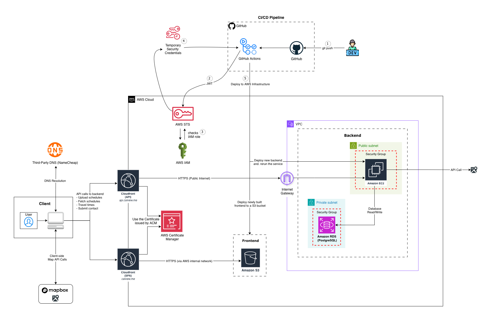

# calview Architecture Overview

This document provides a comprehensive overview of the **calview** application architecture, including component diagrams, data flow, deployment infrastructure, and recommendations for scaling.

## Table of Contents
- [High-Level Architecture](#high-level-architecture)
- [Technology Stack](#technology-stack)
- [Frontend Architecture](#frontend-architecture)
- [Backend Architecture](#backend-architecture)
- [Database Schema](#database-schema)
- [Data Flow](#data-flow)
- [Authentication & Secrets](#authentication--secrets)
- [CI/CD Pipeline](#cicd-pipeline)
- [Deployment Architecture](#deployment-architecture)
- [Scaling & Recommendations](#scaling--recommendations)

---

## High-Level Architecture

Current Architecture Diagram (https://calview.me)


## Technology Stack

### Frontend

- **Framework:** React 19.1
- **Build Tool:** Vite 6.3  
- **Styling:** Tailwind CSS 4.1  
- **Maps:** Mapbox GL JS 3.10  

### Backend

- **Framework:** FastAPI 0.115
- **ASGI Server:** Uvicorn 0.34  
- **ORM:** SQLModel 0.0.24 (SQLAlchemy 2.0)
- **Maps:** Google Maps API 4.10  

### Infrastructure

- **CI/CD:** GitHub Actions, OIDC  
- **Hosting:** AWS (S3, CloudFront, EC2)  
- **Containerization:** Docker Compose (for local DB development)  

## Frontend Architecture

### Entry Points

- `frontend/index.html` - HTML template  
- `frontend/src/main.jsx` - React bootstrap  
- `frontend/src/App.jsx` - Router configuration  

### Directory Structure

```
frontend/src/
├── main.jsx              # Application entry point
├── App.jsx               # Route definitions
├── index.css             # Global styles (Tailwind imports)
├── pages/
│   ├── HomePage.jsx      # Landing page with file upload
│   ├── SchedulePage.jsx  # Map + event list view
│   ├── CalendarPage.jsx  # Weekly calendar grid view
│   ├── AboutPage.jsx     # About page (lazy-loaded)
│   ├── HelpPage.jsx      # Help documentation
│   └── ...               # Legal and Contact pages
├── components/
│   ├── Layout.jsx        # Page wrapper (Navbar + Footer)
│   ├── FileUpload.jsx    # ICS file upload component
│   ├── WeeklyCalendar.jsx # Main calendar grid component
│   ├── ScheduleList.jsx  # Event list with commute times
│   ├── calendar/         # Sub-components for Calendar Grid
│   └── map/              # Sub-components for Mapbox integration
└── lib/
    ├── api.js            # Axios instances and API requests
    ├── session.js        # localStorage helpers for session persistence
    └── logger.js         # Development logging utilities
```

## Backend Architecture

### Entry Point

- `backend/app/main.py` - FastAPI application setup  

### Directory Structure

```text
backend/
├── app/
│   ├── main.py           # FastAPI app, middleware, CORS
│   ├── api/
│   │   └── routes.py     # API endpoint definitions
│   ├── models.py         # SQLModel database models
│   ├── database.py       # Database connection setup
│   ├── utils.py          # ICS parsing & geocoding logic
│   └── middleware/
│       └── rate_limit.py # Custom rate limiting
├── tests/                # PyTest test suite
├── docker-compose.yml    # Local PostgreSQL setup
└── routify.service       # Systemd service file for EC2
```

### Key API Endpoints

| Method | Endpoint | Description |
|--------|----------|-------------|
| POST | `/api/sessions` | Parses uploaded `.ics`, geocodes locations, and creates a session |
| GET | `/api/sessions/{short_id}` | Retrieves parsed events for a specific session |
| POST | `/api/distance-matrix` | Calculates travel times (proxy to Google Maps) |
| POST | `/api/contact` | Handles contact form submissions |

## Database Schema

The database is normalized to separate a Session (a group of events from one file upload) from the Events themselves.

```
┌─────────────────────┐       ┌─────────────────────────┐
│    SessionModel     │       │      EventModel         │
├─────────────────────┤       ├─────────────────────────┤
│ id: int (PK)        │───┐   │ id: int (PK)            │
│ uuid: str (indexed) │   │   │ session_id: int (FK)    │
│ created_at: date    │   └──>│ session: Relationship   │
│ events: Relationship│       │ title: str              │
└─────────────────────┘       │ location: str           │
                              │ start_time: time        │
                              │ end_time: time          │
                              │ start_date: date        │
                              │ end_date: date          │
                              │ day_of_week: JSON       │
                              │ latitude: float (opt)   │
                              │ longitude: float (opt)  │
                              └─────────────────────────┘
```

## Data Flow

### 1. ICS Upload & Parsing Flow

When a user uploads a calendar file:

- The browser sends `multipart/form-data` to `POST /api/sessions`.  
- FastAPI receives the file and passes it to `utils.parse_ics()`.  
- The parser extracts event details and identifies location strings.  
- **Geocoding:** Unique locations are sent to the Google Maps API to get latitude/longitude coordinates.  
- **Database:** The `Session` and its `Event` records are saved to PostgreSQL.  
- **Response:** The backend returns a `short_id` (e.g., `Ab3d9`) to the frontend.  
- **Redirect:** The frontend redirects the user to `/view/Ab3d9`.  

### 2. Schedule View Request Flow

When a user visits a schedule link:

- The frontend calls `GET /api/sessions/{short_id}`.  
- The backend decodes the `short_id`, fetches events from the database, and returns JSON.  

**Frontend Map Flow:**
- Uses the Mapbox API to render map markers.  
- Calculates routes between markers client-side.  

**Backend Commute Calculation:**
- The frontend sends `POST /api/distance-matrix` for accurate traffic data.  
- The backend acts as a proxy to the Google Maps Distance Matrix API to protect API keys.  

## Authentication & Secrets

### Environment Variables

**Frontend (`.env`):**
- `VITE_API_BASE_URL` - Backend URL (e.g., `https://api.calview.me`)  
- `VITE_MAPBOX_TOKEN` - Public Mapbox token  

**Backend (`.env`):**
- `DATABASE_URL` - PostgreSQL connection string  
- `MAPS_KEY` - Private server key for geocoding & distance matrix  
- `HASHID_SALT` - Secret salt for generating short URLs  

### Session Management

- **Anonymous Sessions:** No user accounts required.  
- **Persistence:** The `short_id` is stored in the browser’s `localStorage` so users can revisit their last uploaded schedule.  

## CI/CD Pipeline

We use **GitHub Actions** for automated testing and deployment.

**Workflow File:** `.github/workflows/deploy.yml`  

### Pipeline Steps

- **Test Backend:**  
  - Runs `pytest` using SQLite to validate API logic.  

- **Lint Frontend:**  
  - Runs ESLint to check for code quality issues.  

- **Deploy Frontend (main branch only):**  
  - Builds the React app (`npm run build`).  
  - Syncs the `dist/` folder to AWS S3.  
  - Invalidates the CloudFront cache.  

- **Deploy Backend (main branch only):**  
  - SSHs into the EC2 instance.  
  - Pulls the latest code from GitHub.  
  - Updates dependencies (`pip install`).  
  - Restarts the systemd service (`systemctl restart calview`).  

## Deployment Architecture

The application is deployed on AWS using a cost-effective architecture suitable for the Free Tier. For a complete breakdown of the deployment design, please refer to [DEPLOYMENT.md](DEPLOYMENT.md).

## Scaling & Recommendations

### Current Limitations

- **Single EC2 Instance:** The backend runs on a single `t3.micro` instance, creating a Single Point of Failure (SPOF).  
- **Database:** Currently hosted on the same EC2 instance (or local Docker) for cost savings, which risks data loss if the instance fails.  
- **In-Memory Rate Limiting:** Rate limits reset whenever the application restarts.  

### Recommended Improvements

#### Short-Term

- [ ] **External Database:** Migrate PostgreSQL to AWS RDS for managed backups and high availability.  
- [ ] **Health Monitoring:** Set up CloudWatch alarms for API latency and EC2 CPU usage.  

#### Medium-Term

- [ ] **Load Balancing:** Place an Application Load Balancer (ALB) in front of the EC2 instance for SSL termination and future scaling.  
- [ ] **Auto Scaling:** Create an Auto Scaling Group (ASG) to add backend instances during high traffic.  
- [ ] **Redis:** Implement Redis for distributed rate limiting and caching frequent API responses.  

---

## Feedback & Usage

We built **calview** to make visualizing complex schedules easier. We’re actively developing this project and welcome contributors!

- **Use the App:** [https://calview.me](https://calview.me)  
- **Feedback:** We’re always open to feedback. Please use the contact form on the site or open an issue in this repository.  
