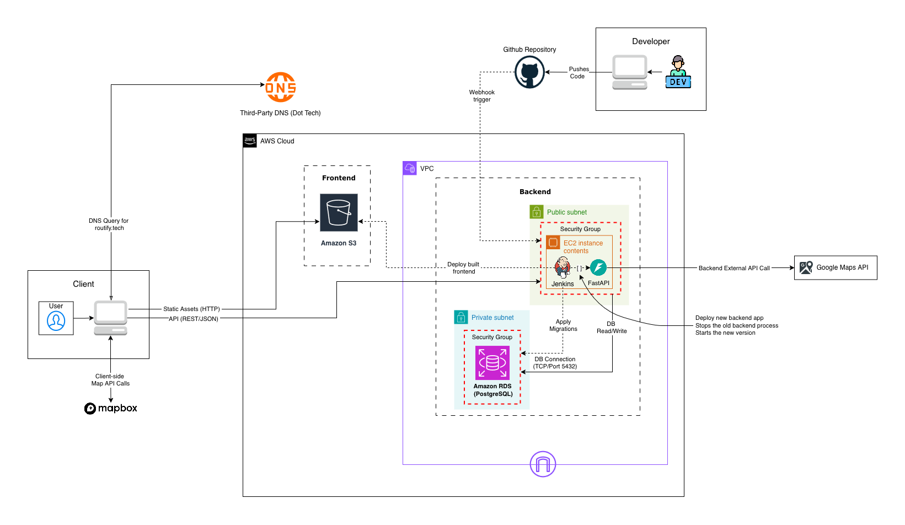

# Calview Deployment Guide

Previous Architecture Diagram (routify.tech)

Current Architecture Diagram (calview.me)

For a detailed, step-by-step explanation of how GitHub Actions uses OIDC to access AWS resources—including how STS, IAM roles, and token claims work together, check out this guide on Qiita: [GitHub Actions with AWS](https://qiita.com/satooshi/items/0c2f5a0e2b64a1d9a4b3)  
It provides a granular look at the authentication flow, trust policies, and best practices for secure deployments.

